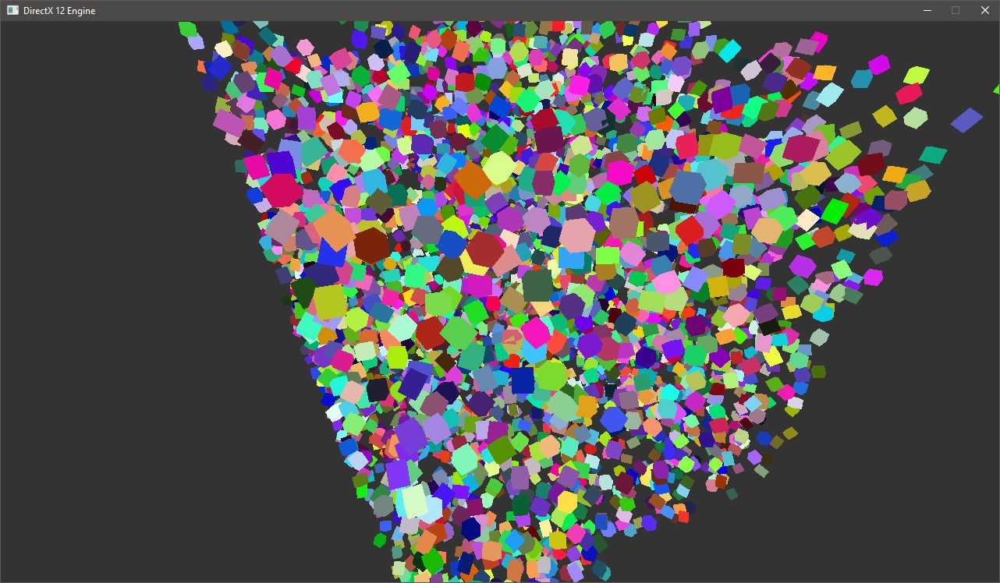

# DirectX-12-Engine
## General Info

This project is a Graphical Engine, that used modern DirectX-12 API to render graphics.

At this time, it's not finished yet, and so I don't recommend to use it.

## Installation
To compile you need to have Windows SDK 10.0.19041.0 and higher.

## Some examples

